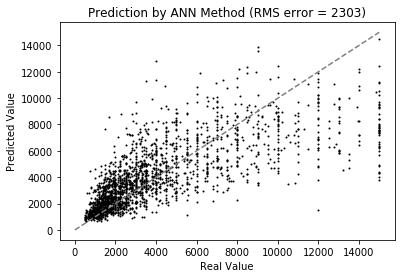

#Predicting House Cost
These are algorithms that I created to practice my machine learning and deep learning skills.

The objective is to test and compare regression methods to suggest the value of rental properties in five Brazilian cities based on the following database:
https://www.kaggle.com/rubenssjr/brasilian-houses-to-rent#houses_to_rent_v2.csv

I tested the following regression methods:
 - Multi linear Regression
 - Decision Tree Regression
 - Random Tree Forest Regression
 - Artificial Neural Network (ANN)

Through visualization of the graphs, the methods that seem to work best are the ANN and random forest regression methods.

