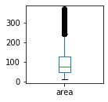
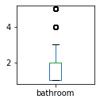
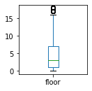
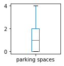
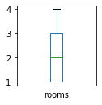
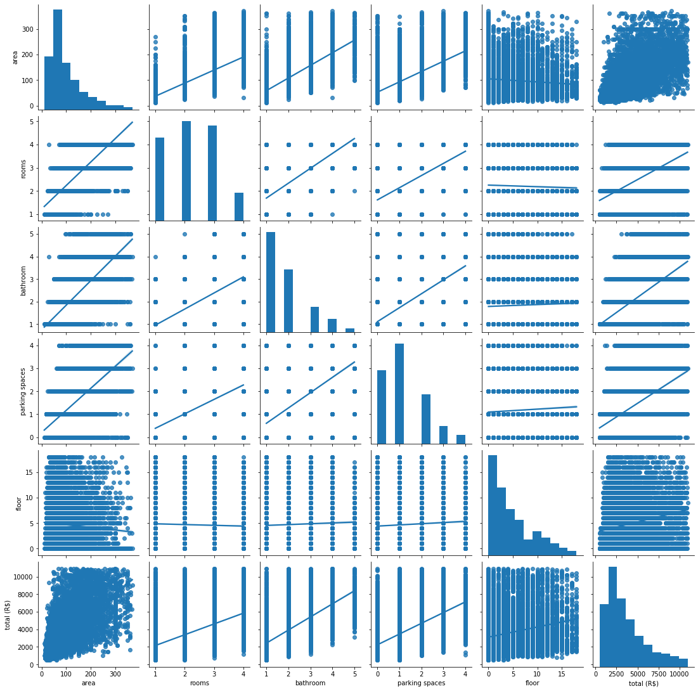

These are algorithms that I created to practice my machine learning and deep learning skills.

The objective is to test and compare regression methods to suggest the value of rental properties in five Brazilian cities based on the following database:
https://www.kaggle.com/rubenssjr/brasilian-houses-to-rent#houses_to_rent_v2.csv

Before creating a predictive machine, I performed an analysis of the data and I removed the outliers:

those are the graphs after I removed the outliers:

This is the Scatterplot Matrix:

It is possible to notice that there is a correlation between some variables, but all of them present very dispersed values.

I tested the following methods:
 - Multi linear Regression
 - Decision Tree Regression
 - Random Tree Forest Regression
 - Artificial Neural Network (ANN)
 
 In this analyses I tested the Principal Component Analysis and Linear Discriminant Analysis methods for dimensionality reduction.

The two methods that have given the best results considering their RMS error indicators are the ANN and random forest regression methods.

Analyzing the relationship of the data using the PCA method, it is concluded that the data that most influences the cost of renting is the fire insurance cost. Adding this data to the regression method can greatly improve the accuracy of the results. In this case, the Random Tree Forest Regression Method obtained the most accurate result. The image below illustrates the comparison of the real data with the predicted data.

